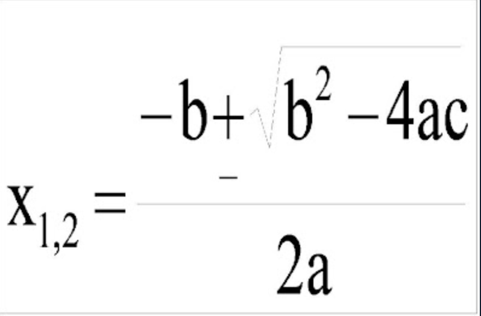

# Promedio de 4 materias
Básicos-Promedio de 4 materias

Modifica el programa que se encuentra en la carpeta `src` que se llama `exercise.py` y que contiene el siguiente código:

```python
def main():
    #escribe tu código abajo de esta línea
    pass

if __name__ == '__main__':
    main()
```

La línea `#escribe tu código abajo de esta línea` es un comentario, el programa la va a ignorar al ejecutarse.

1º Lleva a cabo el ANÁLISIS del siguiente programa posteriormente diseña y programa la solución:
 Desarrolla un programa que lea los coeficientes de un polinomio de 2o orden y calcule sus
 raices por medio de la fórmula general.



El programa debe desplegar las 2 raíces - en esta versión no debes verificar si el polinomio
tiene raices complejas.

Ejemplo del funcionamiento de tu programa:
```
Ingresa el coeficiente a: 1
Ingresa el coeficiente b: 3
Ingresa el coeficiente c: 2
Raiz positiva es : -1.0
Raiz negativa es : -2.0

```

**Nota:** No te preocupes por esta parte del código `if __name__ == '__main__':` por el momento. No la vamos a necesitar para este programa, pero es una buena práctica incluirla y quedará más claro para que sirve en los siguientes ejercicios.

Una vez que termines tu actividad y la hayas probado con `pytest`, subela a tu repositorio en GitHub, con el proceso de commit + push.
